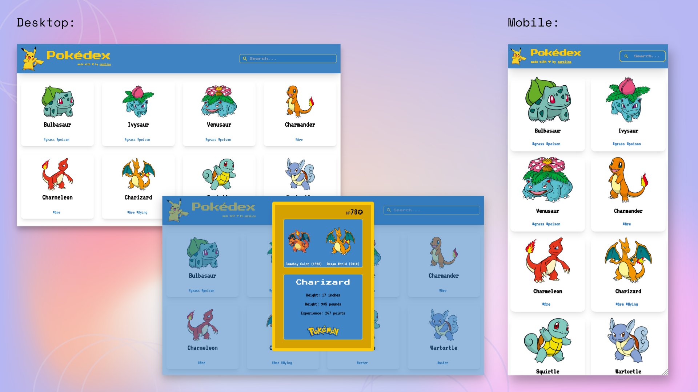

<div align="center">
  
</div>

The Pokedex App is a responsive app where the user can access a complete list of Pokemons, search them and check the details for a specific pokemon by clicking on them. Gotta catch 'em all!

This project was built using the [PokéAPI](https://pokeapi.co/).

## 👀 Try the demo!

https://pokedex-cstrecht.vercel.app/

<div align="center">  
    
   
</div>

## 🔨 Built with:

- [React](https://reactjs.org/)
- [React Router v6](https://reactrouter.com/en/main)
- [Tailwind CSS](https://tailwindcss.com/)
- Deployed with [Vercel](https://vercel.com/dashboard)

## 🚀 Getting Started

```bash
  # Clone the repository:
  $ https://github.com/cstrecht/pokedex.git
  # Enter directory:
  $ cd pokedex
  # Install dependencies:
  $ npm install
  # Start the server:
  $ npm start
```
